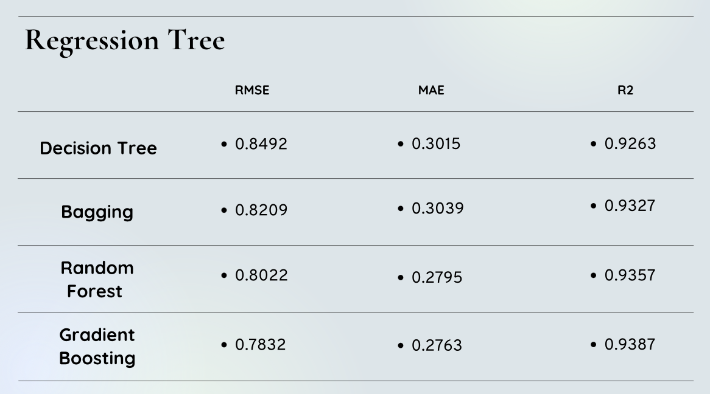
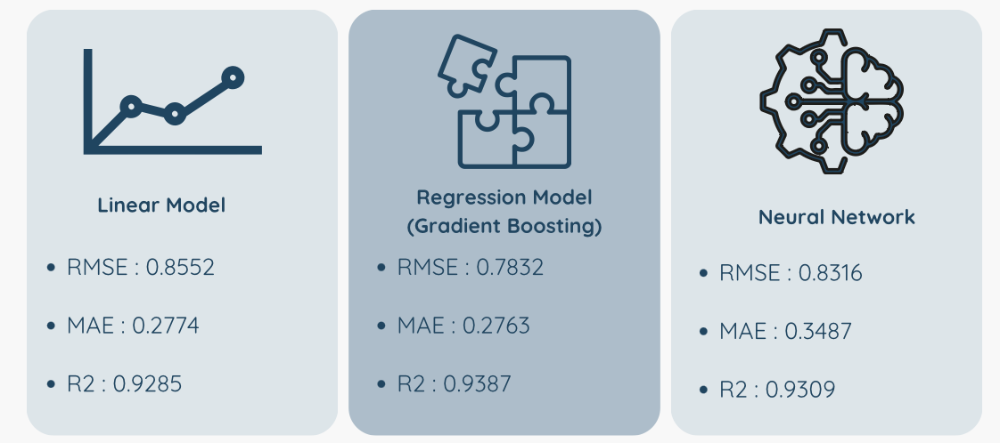

# Flood Level Prediction Using Machine Learning

This project aims to predict the water level at a measurement station 6 hours in advance, using rainfall data and time-lagged water levels. It explores multiple regression models to compare performance and interpret results.

---

## Objective

To forecast river or floodwater levels based on:
- Rainfall data
- Past (time-lagged) water level readings

The goal is to provide short-term flood warnings and insights for environmental monitoring.

---

## Models Used

- **Linear Regression**
- **Decision Tree Regression**
- **Random Forest**
- **Neural Network (MLPRegressor)**

Models were trained and compared using standard evaluation metrics.

---

## Tools & Technologies

- Python (Jupyter Notebook)
- pandas, NumPy, matplotlib
- scikit-learn
- seaborn
- VS Code

---

## Evaluation Metrics

- Mean Squared Error (MSE)
- Mean Absolute Error (MAE)
- R² Score

Each model was evaluated and visualized for accuracy and generalization performance.

---

## Model Performance Summary

### Regression Tree Family Breakdown

Detailed performance metrics for decision tree variants. Gradient Boosting outperformed the others, followed closely by Random Forest.

### Comparison Across Model Types

This comparison shows how linear regression, gradient boosting, and neural networks performed. Gradient Boosting achieved the best balance of RMSE and R² score.

---

## Notebook

> All code, model training, and visualizations are in:  
 `flood-prediction.ipynb`

---

## What I Learned

This was a great opportunity to:
- Work with time series features
- Compare ML models in practice
- Apply evaluation techniques
- Interpret regression results meaningfully

